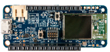
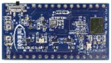
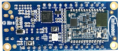
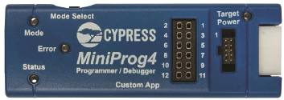
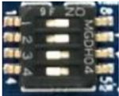
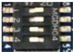
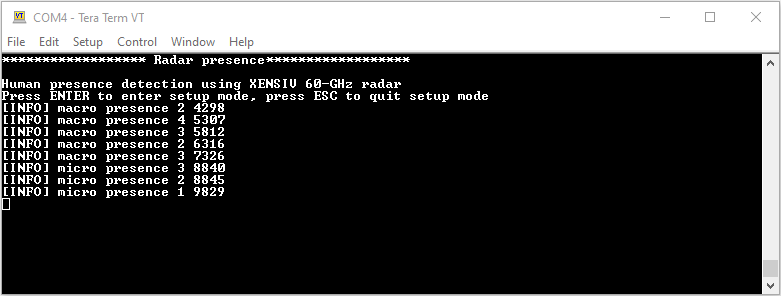
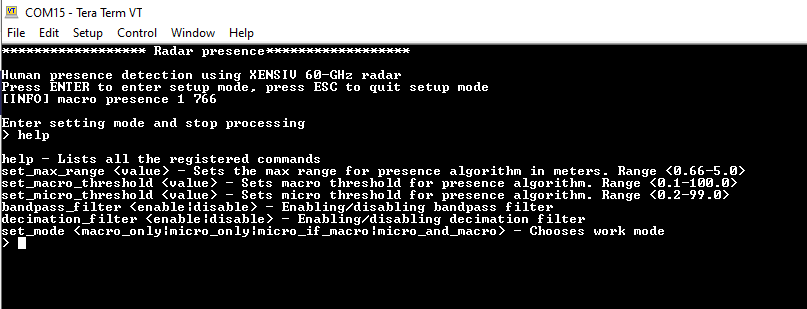
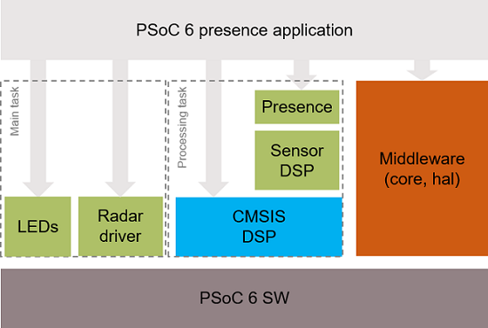
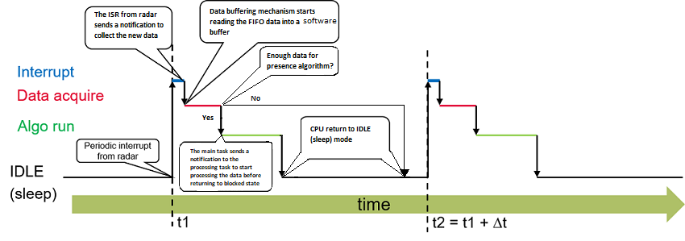

# PSoC&trade; 6 MCU : Human presence detection

## Overview
This code example demonstrates Infineon's radar presence solution to detect human presence within a configurable distance. Powered by the [XENSIV™ 60-GHz radar](https://www.infineon.com/cms/en/product/sensor/radar-sensors/radar-sensors-for-iot/60ghz-radar/bgt60tr13c/), this solution provides extremely high accuracy in detecting both micro and macro motions. The ability to detect micro motion offers unique benefits over conventional technologies deployed to detect human presence, thus making it perfect for user interaction with devices.

[View this README on GitHub.](https://github.com/Infineon/mtb-example-psoc6-radar-presence)

[Provide feedback on this code example.](https://cypress.co1.qualtrics.com/jfe/form/SV_1NTns53sK2yiljn?Q_EED=eyJVbmlxdWUgRG9jIElkIjoiQ0UyMzYwNTciLCJTcGVjIE51bWJlciI6IjAwMi0zNjA1NyIsIkRvYyBUaXRsZSI6IlBTb0MmdHJhZGU7IDYgTUNVIDogSHVtYW4gcHJlc2VuY2UgZGV0ZWN0aW9uIiwicmlkIjoidXNtYW5tdWgiLCJEb2MgdmVyc2lvbiI6IjEuMC4wIiwiRG9jIExhbmd1YWdlIjoiRW5nbGlzaCIsIkRvYyBEaXZpc2lvbiI6Ik1DRCIsIkRvYyBCVSI6IlNCU1lTIiwiRG9jIEZhbWlseSI6IlBTT0MifQ==)

## Requirements


- [ModusToolbox&trade; software](https://www.infineon.com/cms/en/design-support/tools/sdk/modustoolbox-software/) v3.0
- Board support package (BSP) minimum required version: 4.0.0
- Programming language: C
- Associated parts: All [PSoC&trade; 6 MCU](https://www.infineon.com/cms/en/product/microcontroller/32-bit-psoc-arm-cortex-microcontroller/psoc-6-32-bit-arm-cortex-m4-mcu/) parts


## Supported toolchains (make variable 'TOOLCHAIN')

- GNU Arm® embedded compiler v10.3.1 (`GCC_ARM`) - Default value of `TOOLCHAIN`
- Arm&reg; compiler v6.16 (`ARM`)
- IAR C/C++ compiler v8.50.6 (`IAR`)


## Supported kits (make variable 'TARGET')

- [Rapid IoT connect developer kit](https://github.com/Infineon/TARGET_CYSBSYSKIT-DEV-01) (`CYSBSYSKIT-DEV-01`) - Default value of `TARGET`
- [Radar Embedded kit](https://github.com/Infineon/TARGET_KIT-BGT60TR13C-EMBEDD) (`KIT-BGT60TR13C-EMBEDD`)


## Hardware setup

- For Rapid IoT connect developer kit

   This code example requires the XENSIV™ BGT60TR13C radar wing board as part of the connected sensor kit.

   1. Connect the radar wing board to the CYSBSYSKIT-DEV-01 kit through the pin headers.

   2. Connect the CYSBSYSKIT-DEV-01 kit to the PC with the USB cable.
   
      **Figure 1. Rapid IoT connect developer kit**

      
 
      **Figure 2. XENSIV&trade; BGT60TR13C wing**

      

   3. Place the CYSBSYSKIT-DEV-01 kit at a fixed location (for example, the corner of a room) to ensure optimal performance of the presence detection application.

- For Radar Embedded kit

   1. Connect KIT-BGT60TR13C-EMBEDD to the PC with USB cable.
   
      **Figure 3. KIT-BGT60TR13C-EMBEDD**
   
      

   2. Place KIT-BGT60TR13C-EMBEDD at a fixed location (for example, the corner of a room) to ensure optimal performance of the presence detection application.


## Software setup

Install a terminal emulator if you don't have one. This document uses [Tera Term](https://ttssh2.osdn.jp/index.html.en).

This example requires no additional software or tools.


## Using the code example

Create the project and open it using one of the following:

<details><summary><b>In Eclipse IDE for ModusToolbox&trade; software</b></summary>

1. Click the **New Application** link in the **Quick Panel** (or, use **File** > **New** > **ModusToolbox&trade; Application**). This launches the [Project Creator](https://www.infineon.com/ModusToolboxProjectCreator) tool.

2. Select CYSBSYSKIT-DEV-01 kit supported by the code example from the PSoC&trade; 6 BSPs list shown in the **Project Creator - Choose Board Support Package (BSP)** dialog.

   When you select a supported kit, the example is reconfigured automatically to work with the kit. To work with a different supported kit later, use the [Library Manager](https://www.infineon.com/ModusToolboxLibraryManager) to choose the BSP for the supported kit. You can use the Library Manager to select or update the BSP and firmware libraries used in this application. To access the Library Manager, click the link from the **Quick Panel**.

   You can also just start the application creation process again and select a different kit.

   If you want to use the application for a kit not listed here, you may need to update the source files. If the kit does not have the required resources, the application may not work.

3. In the **Project Creator - Select Application** dialog, choose the **Human Presence Detection** from Sensing group by enabling the checkbox.

   **Note:** Please do not confuse this code example with old "Radar Presence Application" located in the same group. This document refers to      **Human Presence Detection** only. 

4. (Optional) Change the suggested **New Application Name**.

5. The **Application(s) Root Path** defaults to the Eclipse workspace which is usually the desired location for the application. If you want to store the application in a different location, you can change the *Application(s) Root Path* value. Applications that share libraries should be in the same root path.

6. Click **Create** to complete the application creation process.

For more details, see the [Eclipse IDE for ModusToolbox&trade; software user guide](https://www.infineon.com/MTBEclipseIDEUserGuide) (locally available at *{ModusToolbox&trade; software install directory}/ide_{version}/docs/mt_ide_user_guide.pdf*).

</details>

<details><summary><b>In command-line interface (CLI)</b></summary>

ModusToolbox&trade; software provides the Project Creator as both a GUI tool and a command line tool, "project-creator-cli". The CLI tool can be used to create applications from a CLI terminal or from within batch files or shell scripts. This tool is available in the *{ModusToolbox&trade; software install directory}/tools_{version}/project-creator/* directory.

Use a CLI terminal to invoke the "project-creator-cli" tool. On Windows, use the command line "modus-shell" program provided in the ModusToolbox&trade; software installation instead of a standard Windows command-line application. This shell provides access to all ModusToolbox&trade; software tools. You can access it by typing `modus-shell` in the search box in the Windows menu. In Linux and macOS, you can use any terminal application.

This tool has the following arguments:

Argument | Description | Required/optional
---------|-------------|-----------
`--board-id` | Defined in the `<id>` field of the [BSP](https://github.com/Infineon?q=bsp-manifest&type=&language=&sort=) manifest | Required
`--app-id`   | Defined in the `<id>` field of the [CE](https://github.com/Infineon?q=ce-manifest&type=&language=&sort=) manifest | Required
`--target-dir`| Specify the directory in which the application is to be created if you prefer not to use the default current working directory | Optional
`--user-app-name`| Specify the name of the application if you prefer to have a name other than the example's default name | Optional

<br />

The following example will clone the "[Human Presence Detection](https://github.com/Infineon/mtb-example-psoc6-radar-presence)" application with the desired name "HumanPresenceDetection" configured for the *CYSBSYSKIT-DEV-01* BSP into the specified working directory, *C:/mtb_projects*:

   ```
   project-creator-cli --board-id CYSBSYSKIT-DEV-01 --app-id mtb-example-psoc6-radar-presence --user-app-name HumanPresenceDetection --target-dir "C:/mtb_projects"
   ```

**Note:** The project-creator-cli tool uses the `git clone` and `make getlibs` commands to fetch the repository and import the required libraries. For details, see the "Project creator tools" section of the [ModusToolbox&trade; software user guide](https://www.infineon.com/ModusToolboxUserGuide) (locally available at *{ModusToolbox&trade; software install directory}/docs_{version}/mtb_user_guide.pdf*).

</details>

<details><summary><b>In third-party IDEs</b></summary>

Use one of the following options:

- **Use the standalone [Project Creator](https://www.infineon.com/ModusToolboxProjectCreator) tool:**

   1. Launch Project Creator from the Windows Start menu or from *{ModusToolbox&trade; software install directory}/tools_{version}/project-creator/project-creator.exe*.

   2. In the initial **Choose Board Support Package** screen, select the BSP and click **Next**.

   3. In the **Select Application** screen, select the appropriate IDE from the **Target IDE** drop-down menu.

   4. Click **Create** and follow the instructions printed in the bottom pane to import or open the exported project in the respective IDE.

<br />

- **Use command-line interface (CLI):**

   1. Follow the instructions from the **In command-line interface (CLI)** section to create the application, and import the libraries using the `make getlibs` command.

   2. Export the application to a supported IDE using the `make <ide>` command.

   3. Follow the instructions displayed in the terminal to create or import the application as an IDE project.

For a list of supported IDEs and more details, see the "Exporting to IDEs" section of the [ModusToolbox&trade; software user guide](https://www.infineon.com/ModusToolboxUserGuide) (locally available at *{ModusToolbox&trade; software install directory}/docs_{version}/mtb_user_guide.pdf*).

</details>

**Note:** To use this code example in ModusToolbox v2.4, please refer to [Infineon-XENSIVTM_KIT_CSK_BGT60TR13C-UserGuide](https://www.infineon.com/cms/en/product/evaluation-boards/kit_csk_bgt60tr13c/#!documents) 

## Operation


1. Mount radar wing board on the CYSBSYSKIT-DEV-01 kit and connect the board to your PC using the provided USB cable through the KitProg3 USB connector.

2. Open a terminal program and select the [KitProg3](https://www.infineon.com/dgdl/Infineon-KitProg3_User_Guide-UserManual-v01_00-EN.pdf?fileId=8ac78c8c7d0d8da4017d0f01221f1853)  COM port. Set the serial port parameters to 8N1 and 115200 baud.

3. Program the board using one of the following:

   <details><summary><b>Using Eclipse IDE for ModusToolbox&trade; software</b></summary>

      1. Select the application project in the Project Explorer.

      2. In the **Quick Panel**, scroll down, and click **\<Application Name> Program (KitProg3_MiniProg4)**.
   </details>

   <details><summary><b>Using CLI</b></summary>

     From the terminal, execute the `make program` command to build and program the application using the default toolchain to the default target. The default toolchain and target are specified in the application's Makefile but you can override those values manually:
      ```
      make program TARGET=<BSP> TOOLCHAIN=<toolchain>
      ```

      Example:
      ```
      make program TARGET=CYSBSYSKIT-DEV-01 TOOLCHAIN=GCC_ARM
      ```
   </details>


 <details><summary><b>For KIT-BGT60TR13C-EMBEDD</b></summary>

 1. To work with KIT-BGT60TR13C-EMBEDD, we need an external programmer, such as MiniProg4, that uses the SWD interface.
 
      **Figure 4. Cypress Mini Programmer**
 
      

      To make the UART work properly on the Radar Embedded kit board, set the proper jumpers on the S3 and S5 switches.
      For the S3 switch, pins 1 and 2 must be closed and pins 3 and 4 must be opened.

      **Figure 5. Switch 3 Position**

      

      For the S5 switch, pins 1 and 2 must be closed and pins 3 and 4 must be opened.
   
      **Figure 6. Switch 5 Position**

      

      Connect KIT-BGT60TR13C-EMBEDD SWD interface with the programmer. Then, plug the USB cables for the board and for the programmer to power on both of them.

2. Open a terminal program and select a COM port where the board is connected (not the MiniProg4 port). Set the serial port parameters to 8N1 and 115200 baud.

3. Program the board using one of the following:
   <details><summary><b>Using Eclipse IDE for ModusToolbox&trade; software</b></summary>

      1. Select the application project in the Project Explorer.

      2. In the **Quick Panel**, scroll down, and click **\<Application Name> Program (KitProg3_MiniProg4)**.
   </details>

   <details><summary><b>Using CLI</b></summary>

     From the terminal, execute:

      ```
      make program TARGET=KIT-BGT60TR13C-EMBEDD TOOLCHAIN=GCC_ARM
      ```

    </details>

</details>

4. After programming, the application starts automatically. Confirm that "Human presence detection using XENSIV 60-GHz radar" is displayed on the UART terminal.

   **Figure 7. Terminal output on program startup**

   

   **Table 1. Terminal output discription**
    | parameters  |  Event type  |  Description  |
   | ----------- | ----------- | -----    |
   | Radar State | macro presence  | Presence event detected.
   | Range bin  | 2 | maximum range bin 
   | Time stamp | '4298' | relative time in ms 
   
   **Note:**
   **Time Stamp** is relative to the boot time. This means when application first boot, the time counting starts from 0 ms.
   **Converstion of range bin to range in meters can be done by using following relation:**
    R (range in meters) = ( xensiv_radar_presence_get_bin_length() * config.max_range_bin )
   **eg: if xensiv_radar_presence_get_bin_length()=0.325**
   then **R=0.325 * 2 =0.66m**
   
5. Confirm that the kit LED blinks at approximately 1 Hz.

 The presence information is  provided either as macro or micro presence which can be seen either through prints on the terminal and also  the onboard LED turns red which indicates radar detected a target. And when the target leaves the detection zone, the terminal prints a absence message and LED turns green. 

### Sensor information and LEDs

1. For CYSBSYSKIT-DEV-01, the radar task is suspended if the radar wing board is not connected to the feather kit. The sensor initialization process is indicated by blinking the red LED (CYBSP_USER_LED). The red LED (CYBSP_USER_LED) on CYSBSYSKIT-DEV-01 keeps blinking when the system is operational (ready state).
Please note that there is no user LED for KIT-BGT60TR13C-EMBEDD board.
 
2. The LED indicates different events with different colors as follows:

    **Table 2. Events and LED indication**

   | LED color  |  Event type  |  Description  |
   | ----------- | ----------- | -----    |
   | Red  | `XENSIV_RADAR_PRESENCE_STATE_MACRO_PRESENCE` | Presence event detected.
   | Red  | `XENSIV_RADAR_PRESENCE_STATE_MICRO_PRESENCE` | Presence event detected.
   | Green  | `XENSIV_RADAR_PRESENCE_STATE_ABSENCE ` | Absence event detected.

### Configuration parameters

You can configure the application parameters using the options provided on the terminal as follows:

1. Press 'enter' key to switch from work to settings mode.
2. Type help and press 'enter' key to see a list of configurable parameters as shown in the **Figure 8**.

    **Figure 8. Configuration mode**

    

   The complete list of configurable paramters with the valid values are shown in **Table 2**:

   **Table 3. Presence algortihm configuration parameters**

   | Key |  Default value  |  Valid Values  |
   | ----------- | ----------- | -----    |
   | set_max_range (m)| 2.0 | 0.66-5.0 | 
   | set_macro_threshold | 0.5 | 0.5-2.0 |
   | set_micro_threshold | 12.5 | 0.2-50.0 | 
   | bandpass_filter | disable | enable/disable|
   | decimation_filter | disable | enable/disable | 
   | set_mode | micro_if_macro | macro_only/micro_only/micro_if_macro/micro_and_macro |
   
   **Micro-motions**:
    Detecting small movements like fingure gestures or small headmovements in  a typical smart home environment for instance while working on lapop/keyboard.Micromotion also includes  detection of Stationary humans (normally breathing and blinking eyes) in sitting or standing positions (in line of sight).
   

   **Macro-motions**:
    Detecting major movements into or through the field of view.(Motion Detection).


   **Note**: Macro and Micro threshold parameters can be adjusted to achieve different levels of sensitivity.The  below table summarises three different levels (for instance high means  -solution being more sensitive to stationary peoples).
    
   **Table 4. Senstivity level with the corresponding threshold setting**
   | Sensitivity|Macro_threshold_value |Micro_threshold_value|
   | ----------- | ----------- | -----    
   | High| 0.5 | 12.5 |
   |Medium | 1.0 | 25 |
   | Low | 2.0 | 50 | 
   
   Note: The user have the provision to set any threshold values based on their use case requirement.
3. Type the command name with given value and press enter. If the parameter update is successful then 'ok' is displayed otherwise 'command not recognised' or 'invalid value' are printed.

For details, see the [XENSIV™ Radar Presence API Reference Guide](https://infineon.github.io/xensiv-radar-presence/html/index.html).

## Debugging


You can debug the example to step through the code. In the IDE, use the **\<Application Name> Debug (KitProg3_MiniProg4)** configuration in the **Quick Panel**. For details, see the "Program and debug" section in the [Eclipse IDE for ModusToolbox&trade; software user guide](https://www.infineon.com/MTBEclipseIDEUserGuide).

**Note:** **(Only while debugging)** On the CM4 CPU, some code in `main()` may execute before the debugger halts at the beginning of `main()`. This means that some code executes twice – once before the debugger stops execution, and again after the debugger resets the program counter to the beginning of `main()`. See [KBA231071](https://community.infineon.com/docs/DOC-21143) to learn about this and for the workaround.


## Design and implementation

### Resources and settings
This application uses a modular approach to build a presence application combining radar driver and presence algortihm library. The components used in this application are shown in **Figure 9**. 

**Figure 9. Application overview**



The radar configuration parameters are generated from a PC tool and saved in radar_settings.h, for more details please refer to [XENSIV™ BGT60TRxx Radar API Reference Guide](https://infineon.github.io/sensor-xensiv-bgt60trxx/html/index.html).
The user can also view the radar raw data and the presence library configuration parameters. After the initialization the application runs in an event driven way. The radar interrupt is used to notify to main task which then retrieves the radar data and provides it to the presence library. 

**Figure 10. Application Execution**




**Table 5. Application resources**

 Resource  |  Alias/object     |    Purpose
 :-------- | :-------------    | :------------
 UART (HAL)|cy_retarget_io_uart_obj| UART HAL object used by Retarget-IO for the Debug UART port
 SPI (HAL)    | spi     | SPI master driver to communicate with radar sensor
 GPIO (HAL)    | CYBSP_USER_LED     | User LED
 GPIO (HAL)    | CYBSP_USER_LED_RED     | User LED
 GPIO (HAL)    | CYBSP_USER_LED_GREEN    | User LED
 GPIO (HAL)    | CYBSP_USER_LED_BLUE     | User LED

<br />

## Related resources


Resources  | Links
-----------|----------------------------------
Application notes  | [AN228571](https://www.infineon.com/AN228571) – Getting started with PSoC&trade; 6 MCU on ModusToolbox&trade; software <br />  [AN215656](https://www.infineon.com/AN215656) – PSoC&trade; 6 MCU: Dual-CPU system design <br />
Code examples  | [Using ModusToolbox&trade; software](https://github.com/Infineon/Code-Examples-for-ModusToolbox-Software) on GitHub <br />
Device documentation | [PSoC&trade; 6 MCU datasheets](https://www.infineon.com/cms/en/product/microcontroller/32-bit-psoc-arm-cortex-microcontroller/psoc-6-32-bit-arm-cortex-m4-mcu/#!documents) <br /> [PSoC&trade; 6 technical reference manuals](https://www.infineon.com/cms/en/product/microcontroller/32-bit-psoc-arm-cortex-microcontroller/psoc-6-32-bit-arm-cortex-m4-mcu/#!documents)<br />
Development kits | [XENSIV&trade; KIT CSK BGT60TR13C](https://www.infineon.com/cms/en/product/evaluation-boards/kit_csk_bgt60tr13c/) <br> [MM5D91-00 Presence Detection Evaluation Kit](https://www.arrow.com/en/products/mm5d91e00/jorjin-technologies)
Libraries on GitHub  | [sensor-xensiv-bgt60trxx](https://github.com/Infineon/sensor-xensiv-bgt60trxx) –  Driver library to interface with the XENSIV&trade; BGT60TRxx 60 GHz FMCW Radar Sensors <br /> [xensiv-radar-presence](https://github.com/Infineon/xensiv-radar-presence) – Presence library to detect human presence using XENSIV&trade; BGT60TR13C <br /> [sensor-dsp](https://github.com/Infineon/sensor-dsp) – Sensor-DSP library to provide signal processing functions for sensor applications <br /> [mtb-pdl-cat1](https://github.com/Infineon/mtb-pdl-cat1) – PSoC&trade; 6 peripheral driver library (PDL)  <br /> [mtb-hal-cat1](https://github.com/Infineon/mtb-hal-cat1) – Hardware abstraction layer (HAL) library <br /> [retarget-io](https://github.com/Infineon/retarget-io) – Utility library to retarget STDIO messages to a UART port <br />
Middleware on GitHub  |  [psoc6-middleware](https://github.com/Infineon/modustoolbox-software#psoc-6-middleware-libraries) – Links to all PSoC&trade; 6 MCU middleware
Tools  | [Eclipse IDE for ModusToolbox&trade; software](https://www.infineon.com/modustoolbox) – ModusToolbox&trade; software is a collection of easy-to-use software and tools enabling rapid development with Infineon MCUs, covering applications from embedded sense and control to wireless and cloud-connected systems using AIROC&trade; Wi-Fi and Bluetooth® connectivity devices. <br />

<br />

## Other resources

Infineon provides a wealth of data at www.infineon.com to help you select the right device, and quickly and effectively integrate it into your design.

For PSoC&trade; 6 MCU devices, see [How to design with PSoC&trade; 6 MCU - KBA223067](https://community.infineon.com/docs/DOC-14644) in the Infineon community.

For more information about Connected-Sensor-Kit, see [IoT Sensors Platform](https://www.infineon.com/connectedsensorkit) and [Infineon’s XENSIV&trade; connected sensor kit (CSK)](https://livestream.com/infineontechnologies/connected-sensor-kit)
## Document history


Document title: *CE236057* – *PSoC&trade; 6 MCU : Human presence detection*

 Version | Description of change
 ------- | ---------------------
 0.5.1   | New code example
 1.0.0   | Major update to support ModusToolbox&trade; software v3.0 <br /> CE will not be backward compatible with previous versions of ModusToolbox&trade; software 
<br />


---------------------------------------------------------

© Cypress Semiconductor Corporation, 2020-2022. This document is the property of Cypress Semiconductor Corporation, an Infineon Technologies company, and its affiliates ("Cypress").  This document, including any software or firmware included or referenced in this document ("Software"), is owned by Cypress under the intellectual property laws and treaties of the United States and other countries worldwide.  Cypress reserves all rights under such laws and treaties and does not, except as specifically stated in this paragraph, grant any license under its patents, copyrights, trademarks, or other intellectual property rights.  If the Software is not accompanied by a license agreement and you do not otherwise have a written agreement with Cypress governing the use of the Software, then Cypress hereby grants you a personal, non-exclusive, nontransferable license (without the right to sublicense) (1) under its copyright rights in the Software (a) for Software provided in source code form, to modify and reproduce the Software solely for use with Cypress hardware products, only internally within your organization, and (b) to distribute the Software in binary code form externally to end users (either directly or indirectly through resellers and distributors), solely for use on Cypress hardware product units, and (2) under those claims of Cypress’s patents that are infringed by the Software (as provided by Cypress, unmodified) to make, use, distribute, and import the Software solely for use with Cypress hardware products.  Any other use, reproduction, modification, translation, or compilation of the Software is prohibited.
<br />
TO THE EXTENT PERMITTED BY APPLICABLE LAW, CYPRESS MAKES NO WARRANTY OF ANY KIND, EXPRESS OR IMPLIED, WITH REGARD TO THIS DOCUMENT OR ANY SOFTWARE OR ACCOMPANYING HARDWARE, INCLUDING, BUT NOT LIMITED TO, THE IMPLIED WARRANTIES OF MERCHANTABILITY AND FITNESS FOR A PARTICULAR PURPOSE.  No computing device can be absolutely secure.  Therefore, despite security measures implemented in Cypress hardware or software products, Cypress shall have no liability arising out of any security breach, such as unauthorized access to or use of a Cypress product. CYPRESS DOES NOT REPRESENT, WARRANT, OR GUARANTEE THAT CYPRESS PRODUCTS, OR SYSTEMS CREATED USING CYPRESS PRODUCTS, WILL BE FREE FROM CORRUPTION, ATTACK, VIRUSES, INTERFERENCE, HACKING, DATA LOSS OR THEFT, OR OTHER SECURITY INTRUSION (collectively, "Security Breach").  Cypress disclaims any liability relating to any Security Breach, and you shall and hereby do release Cypress from any claim, damage, or other liability arising from any Security Breach.  In addition, the products described in these materials may contain design defects or errors known as errata which may cause the product to deviate from published specifications. To the extent permitted by applicable law, Cypress reserves the right to make changes to this document without further notice. Cypress does not assume any liability arising out of the application or use of any product or circuit described in this document. Any information provided in this document, including any sample design information or programming code, is provided only for reference purposes.  It is the responsibility of the user of this document to properly design, program, and test the functionality and safety of any application made of this information and any resulting product.  "High-Risk Device" means any device or system whose failure could cause personal injury, death, or property damage.  Examples of High-Risk Devices are weapons, nuclear installations, surgical implants, and other medical devices.  "Critical Component" means any component of a High-Risk Device whose failure to perform can be reasonably expected to cause, directly or indirectly, the failure of the High-Risk Device, or to affect its safety or effectiveness.  Cypress is not liable, in whole or in part, and you shall and hereby do release Cypress from any claim, damage, or other liability arising from any use of a Cypress product as a Critical Component in a High-Risk Device. You shall indemnify and hold Cypress, including its affiliates, and its directors, officers, employees, agents, distributors, and assigns harmless from and against all claims, costs, damages, and expenses, arising out of any claim, including claims for product liability, personal injury or death, or property damage arising from any use of a Cypress product as a Critical Component in a High-Risk Device. Cypress products are not intended or authorized for use as a Critical Component in any High-Risk Device except to the limited extent that (i) Cypress’s published data sheet for the product explicitly states Cypress has qualified the product for use in a specific High-Risk Device, or (ii) Cypress has given you advance written authorization to use the product as a Critical Component in the specific High-Risk Device and you have signed a separate indemnification agreement.
<br />
Cypress, the Cypress logo, and combinations thereof, WICED, ModusToolbox, PSoC, CapSense, EZ-USB, F-RAM, and Traveo are trademarks or registered trademarks of Cypress or a subsidiary of Cypress in the United States or in other countries. For a more complete list of Cypress trademarks, visit www.infineon.com. Other names and brands may be claimed as property of their respective owners.
