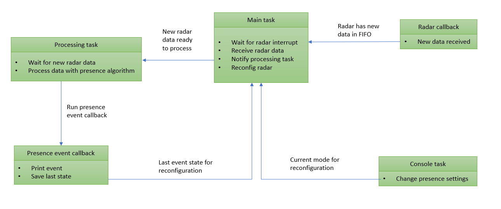
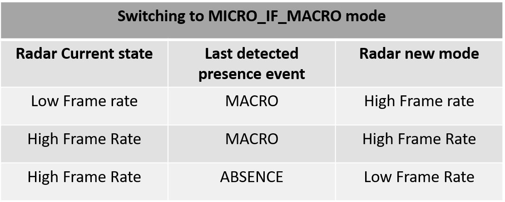

# PSoC&trade; 6 MCU: Human Presence Detection with XENSIV™ 60-GHz Radar

This code example demonstrates Infineon's radar presence solution to detect human presence within a configurable distance. Powered by the [XENSIV™ 60-GHz radar](https://www.infineon.com/cms/en/product/sensor/radar-sensors/radar-sensors-for-iot/60ghz-radar/bgt60tr13c/), this solution provides extremely high accuracy in detecting both micro and macro motions that enable efficient user interaction with devices.

[View this README on GitHub.](https://github.com/Infineon/mtb-example-psoc6-radar-presence)

[Provide feedback on this code example.](https://cypress.co1.qualtrics.com/jfe/form/SV_1NTns53sK2yiljn?Q_EED=eyJVbmlxdWUgRG9jIElkIjoiQ0UyMzYwNTciLCJTcGVjIE51bWJlciI6IjAwMi0zNjA1NyIsIkRvYyBUaXRsZSI6IlBTb0MmdHJhZGU7IDYgTUNVOiBIdW1hbiBQcmVzZW5jZSBEZXRlY3Rpb24gd2l0aCBYRU5TSVbihKIgNjAtR0h6IFJhZGFyIiwicmlkIjoidXNtYW5tdWgiLCJEb2MgdmVyc2lvbiI6IjIuMS4wIiwiRG9jIExhbmd1YWdlIjoiRW5nbGlzaCIsIkRvYyBEaXZpc2lvbiI6Ik1DRCIsIkRvYyBCVSI6IlNCU1lTIiwiRG9jIEZhbWlseSI6IlBTT0MifQ==)


## Configuration on the fly

This code example uses a special optimization mechanism to demonstrate the switching between different radar device configurations on the fly. Depending on the application use case, you may want to switch between two or more radar configurations. For example, you can switch from radar device configured for presence detection to gesture control based on certain conditions within the user application (e.g., the range bin information of the detected target).
In this particular code example, we demonstrate how the human presence application can benefit using power saving features enabled using dynamic reconfiguration. The present example uses the opportunity to save power by reconfiguring the radar sensor to slow down the frame rate. This is beneficial especially when running in the micro_if_macro mode. This mechanism is detailed in [Optimization mechanism](#optimization-mechanism).


## Requirements

- [ModusToolbox&trade; software](https://www.infineon.com/modustoolbox) v3.0 or later (tested with v3.0)
- Board support package (BSP) minimum required version: 4.0.0
- Programming language: C
- Associated parts: All [PSoC&trade; 6 MCU](https://www.infineon.com/cms/en/product/microcontroller/32-bit-psoc-arm-cortex-microcontroller/psoc-6-32-bit-arm-cortex-m4-mcu/) parts


## Supported toolchains (make variable 'TOOLCHAIN')

- GNU Arm® Embedded Compiler v10.3.1 (`GCC_ARM`) – Default value of `TOOLCHAIN`
- Arm&reg; Compiler v6.16 (`ARM`)
- IAR C/C++ Compiler v9.30.1 (`IAR`)


## Supported kits (make variable 'TARGET')

- [Rapid IoT connect developer kit](https://github.com/Infineon/TARGET_CYSBSYSKIT-DEV-01) (`CYSBSYSKIT-DEV-01`) – Default value of `TARGET`
- [Radar Embedded kit](https://github.com/Infineon/TARGET_KIT-BGT60TR13C-EMBEDD) (`KIT-BGT60TR13C-EMBEDD`)
- [PSoC&trade; 6 AI Evaluation Kit](https://www.infineon.com/CY8CKIT-062S2-AI) (`CY8CKIT-062S2-AI`)


## Hardware setup

### For Rapid IoT Connect Developer Kit

This code example requires the XENSIV™ BGT60TR13C Radar Wing Board as part of the connected sensor kit.

1. Connect the radar wing board to the CYSBSYSKIT-DEV-01 kit through the pin headers.

2. Connect the CYSBSYSKIT-DEV-01 kit to the PC with the USB cable.

   **Figure 1. Rapid IoT Connect Developer Kit**

   

   <br>

   **Figure 2. XENSIV&trade; BGT60TR13C Wing Board**

   

3. Place the CYSBSYSKIT-DEV-01 kit at a fixed location (for example, the corner of a room) to ensure optimal performance of the presence detection application.


### For Radar Embedded Kit

1. Connect KIT-BGT60TR13C-EMBEDD to the PC with USB cable.

   **Figure 3. KIT-BGT60TR13C-EMBEDD**

   

2. Place KIT-BGT60TR13C-EMBEDD at a fixed location (for example, the corner of a room) to ensure optimal performance of the presence detection application.

### For PSoC 6 AI Evaluation Kit

1. Connect CY8CKIT-062S2-AI to the PC with USB cable.

   **Figure 4. CY8CKIT-062S2-AI**

   

2. Place CY8CKIT-062S2-AI at a fixed location (for example, the corner of a room) to ensure optimal performance of the presence detection application.

## Software setup

Install a terminal emulator if you don't have one. This document uses [Tera Term](https://ttssh2.osdn.jp/index.html.en).

This example requires no additional software or tools.


## Using the code example

Create the project and open it using one of the following:

<details><summary><b>In Eclipse IDE for ModusToolbox&trade;</b></summary>

1. Click the **New Application** link in the **Quick Panel** (or, use **File** > **New** > **ModusToolbox&trade; Application**). This launches the [Project Creator](https://www.infineon.com/ModusToolboxProjectCreator) tool.

2. Select the CYSBSYSKIT-DEV-01 kit supported by the code example from the PSoC&trade; 6 BSPs list shown in the **Project Creator - Choose Board Support Package (BSP)** dialog.

   When you select a supported kit, the example is reconfigured automatically to work with the kit. To work with a different supported kit later, use the [Library Manager](https://www.infineon.com/ModusToolboxLibraryManager) to choose the BSP for the supported kit. You can use the Library Manager to select or update the BSP and firmware libraries used in this application. To access the Library Manager, click the link from the **Quick Panel**.

   You can also just start the application creation process again and select a different kit.

   If you want to use the application for a kit not listed here, you may need to update the source files. If the kit does not have the required resources, the application may not work.

3. In the **Project Creator - Select Application** dialog, choose the **Human Presence Detection** application from the *Sensing* group.

   **Note:** Make sure that you choose the **Human Presence Detection** example, and NOT the "Radar Presence Application" located in the same group. This document refers only to the *Human Presence Detection* application.

4. (Optional) Change the suggested **New Application Name**.

5. The **Application(s) Root Path** defaults to the Eclipse workspace which is usually the desired location for the application. If you want to store the application in a different location, you can change the *Application(s) Root Path* value. Applications that share libraries should be in the same root path.

6. Click **Create** to complete the application creation process.

For more details, see the [Eclipse IDE for ModusToolbox&trade; user guide](https://www.infineon.com/MTBEclipseIDEUserGuide) (locally available at *{ModusToolbox&trade; install directory}/ide_{version}/docs/mt_ide_user_guide.pdf*).

</details>

<details><summary><b>In command-line interface (CLI)</b></summary>

ModusToolbox&trade; provides the Project Creator as both a GUI tool and a command line tool, "project-creator-cli". The CLI tool can be used to create applications from a CLI terminal or from within batch files or shell scripts. This tool is available in the *{ModusToolbox&trade; install directory}/tools_{version}/project-creator/* directory.

Use a CLI terminal to invoke the "project-creator-cli" tool. On Windows, use the command line "modus-shell" program provided in the ModusToolbox&trade; installation instead of a standard Windows command-line application. This shell provides access to all ModusToolbox&trade; tools. You can access it by typing `modus-shell` in the search box in the Windows menu. In Linux and macOS, you can use any terminal application.

This tool has the following arguments:

Argument | Description | Required/optional
---------|-------------|-----------
`--board-id` | Defined in the `<id>` field of the [BSP](https://github.com/Infineon?q=bsp-manifest&type=&language=&sort=) manifest | Required
`--app-id`   | Defined in the `<id>` field of the [CE](https://github.com/Infineon?q=ce-manifest&type=&language=&sort=) manifest | Required
`--target-dir`| Specify the directory in which the application is to be created if you prefer not to use the default current working directory | Optional
`--user-app-name`| Specify the name of the application if you prefer to have a name other than the example's default name | Optional

<br>

The following example will clone the "[Human Presence Detection](https://github.com/Infineon/mtb-example-psoc6-radar-presence)" application with the desired name "HumanPresenceDetection" configured for the *CYSBSYSKIT-DEV-01* BSP into the specified working directory, *C:/mtb_projects*:

   ```
   project-creator-cli --board-id CYSBSYSKIT-DEV-01 --app-id mtb-example-psoc6-radar-presence --user-app-name HumanPresenceDetection --target-dir "C:/mtb_projects"
   ```

**Note:** The project-creator-cli tool uses the `git clone` and `make getlibs` commands to fetch the repository and import the required libraries. For details, see the "Project creator tools" section of the [ModusToolbox&trade; user guide](https://www.infineon.com/ModusToolboxUserGuide) (locally available at *{ModusToolbox&trade; install directory}/docs_{version}/mtb_user_guide.pdf*).

</details>

<details><summary><b>In third-party IDEs</b></summary>

Use one of the following options:

- **Use the standalone [Project Creator](https://www.infineon.com/ModusToolboxProjectCreator) tool:**

   1. Launch Project Creator from the Windows Start menu or from *{ModusToolbox&trade; install directory}/tools_{version}/project-creator/project-creator.exe*.

   2. In the initial **Choose Board Support Package** screen, select the BSP and click **Next**.

   3. In the **Select Application** screen, select the appropriate IDE from the **Target IDE** drop-down menu.

   4. Click **Create** and follow the instructions printed in the bottom pane to import or open the exported project in the respective IDE.

<br>

- **Use command-line interface (CLI):**

   1. Follow the instructions from the **In command-line interface (CLI)** section to create the application, and import the libraries using the `make getlibs` command.

   2. Export the application to a supported IDE using the `make <ide>` command.

   3. Follow the instructions displayed in the terminal to create or import the application as an IDE project.

For a list of supported IDEs and more details, see the "Exporting to IDEs" section of the [ModusToolbox&trade; user guide](https://www.infineon.com/ModusToolboxUserGuide) (locally available at *{ModusToolbox&trade; install directory}/docs_{version}/mtb_user_guide.pdf*).

</details>

**Note:** To use this code example in ModusToolbox v2.4, see [XENSIV&trade; KIT_CSK_BGT60TR13C user guide](https://www.infineon.com/cms/en/product/evaluation-boards/kit_csk_bgt60tr13c/#!documents).


## Operation

1. Mount the radar wing board on the CYSBSYSKIT-DEV-01 kit and connect the board to your PC using the provided USB cable through the KitProg3 USB connector.

2. Open a terminal program and select the [KitProg3](https://www.infineon.com/dgdl/Infineon-KitProg3_User_Guide-UserManual-v01_00-EN.pdf?fileId=8ac78c8c7d0d8da4017d0f01221f1853) COM port. Set the serial port parameters to 8N1 and 115200 baud.

3. Program the board using one of the following:

   <details><summary><b>Using Eclipse IDE for ModusToolbox&trade;</b></summary>

      1. Select the application project in the Project Explorer.

      2. In the **Quick Panel**, scroll down, and click **\<Application Name> Program (KitProg3_MiniProg4)**.

   </details>

   <details><summary><b>Using CLI</b></summary>

     From the terminal, execute the `make program` command to build and program the application using the default toolchain to the default target. The default toolchain and target are specified in the application's Makefile but you can override those values manually:
      ```
      make program TARGET=<BSP> TOOLCHAIN=<toolchain>
      ```

      Example:
      ```
      make program TARGET=CYSBSYSKIT-DEV-01 TOOLCHAIN=GCC_ARM
      ```
   </details>


4. *(Only for KIT-BGT60TR13C-EMBEDD)* KIT-BGT60TR13C-EMBEDD requires an external programmer such as MiniProg4 that uses the SWD interface. Set the proper jumpers on switches S3 and S5.

   1. Switch S3: Close pins 1 and 2, and open pins 3 and 4.

      **Figure 5. Switch 3 position**

      

   2. Switch S5: Close pins 1 and 2, and open pins 3 and 4.

      **Figure 6. Switch 5 position**

      

   3. Connect KIT-BGT60TR13C-EMBEDD SWD interface with the programmer. Then, plug the USB cables for the board and for the programmer to power on both.

   4. Open a terminal program and select a COM port where the board is connected (not the MiniProg4 port). Set the serial port parameters to 8N1 and 115200 baud.

   5. Program the board using one of the following:

      <details><summary><b>Using Eclipse IDE for ModusToolbox&trade;</b></summary>

      1. Select the application project in the Project Explorer.

      2. In the **Quick Panel**, scroll down, and click **\<Application Name> Program (KitProg3_MiniProg4)**.
      </details>

      <details><summary><b>Using CLI</b></summary>

       From the terminal, execute:

       ```
       make program TARGET=KIT-BGT60TR13C-EMBEDD TOOLCHAIN=GCC_ARM
       ```
       </details>


5. After programming, the application starts automatically. Confirm that "Human presence detection using XENSIV 60-GHz radar" is displayed on the UART terminal.
   The information that is printed out is in the following format:
   [INFO] *Radar State* *Range Bin* *Time stamp*
   *Current presence state*, *Current radar setting*

   **Figure 7. Terminal output choosing different configs**

   

   <br>

   **Table 1. Terminal outputs**

    | Parameters  | Event type  | Description  |
   | ----------- | ----------- | -----    |
   | Radar State | Macro presence  | Presence event detected.
   | Range bin  | 2 | Maximum range bin
   | Time stamp | '4298' | Relative time in ms
   | Current presence state | 0 | 0: Macro, 1: Micro, 2: Absence
   | Current radar setting | 10 Hz | 10 Hz: Low frame rate <br> 200 Hz: High frame rate

   **Note:** *Time Stamp* is relative to the boot time. This means that when the application boots up first, the time counting starts from 0 ms.

   Conversion of range bin to range in meters can be done by using the following relation:

   ```
   R (range in meters) = (xensiv_radar_presence_get_bin_length() * config.max_range_bin)
   ```

   For example: If `xensiv_radar_presence_get_bin_length()` = 0.325, **R = 0.325 * 2 = 0.66 m**

6. Confirm that the kit LED blinks at approximately 1 Hz.

   The presence information is provided either as a macro or micro presence which can be seen through prints on the terminal. In addition, the onboard LED turns red which indicates that the radar detected a target. When the target leaves the detection zone, the terminal prints a absence message and LED turns green. For CY8CKIT-062S2-AI, LED2 (red) will turn ON for absence message.

### Sensor information and LEDs

1. For CYSBSYSKIT-DEV-01, the radar task is suspended if the radar wing board is not connected to the feather kit. The sensor initialization process is indicated by blinking the red LED (CYBSP_USER_LED). The red LED (CYBSP_USER_LED) on CYSBSYSKIT-DEV-01 keeps blinking when the system is operational (ready state).

   Note that there is no user LED for KIT-BGT60TR13C-EMBEDD board.

2. The LED indicates different events with different colors as follows:

   **Table 2. Events and LED indication for CYSBSYSKIT-DEV-01 and KIT-BGT60TR13C-EMBEDD**

   | LED color  | Event type  | Description  |
   | ----------- | ----------- | -----    |
   | Red  | `XENSIV_RADAR_PRESENCE_STATE_MACRO_PRESENCE` | Presence event detected.
   | Red  | `XENSIV_RADAR_PRESENCE_STATE_MICRO_PRESENCE` | Presence event detected.
   | Green  | `XENSIV_RADAR_PRESENCE_STATE_ABSENCE ` | Absence event detected.

   **Table 3. Events and LED indication for CY8CKIT-062S2-AI**

   | LED color  | Event type  | Description  |
   | ----------- | ----------- | -----    |
   | Red (LED1)  | `XENSIV_RADAR_PRESENCE_STATE_MACRO_PRESENCE` | Presence event detected.
   | Red (LED1)  | `XENSIV_RADAR_PRESENCE_STATE_MICRO_PRESENCE` | Presence event detected.
   | Red (LED2)  | `XENSIV_RADAR_PRESENCE_STATE_ABSENCE ` | Absence event detected.


### Configuration parameters

You can configure the application parameters using the options provided on the terminal as follows:

1. Press **Enter** to switch from 'work' to 'settings' mode.

2. Type `help` and press **Enter** to see a list of configurable parameters as shown in the Figure 7.

    **Figure 8. Configuration mode**

    

   The following table lists the configurable parameters with valid values:

   **Table 4. Presence algorithm configuration parameters**

   | Key | Default value  | Valid Values  |
   | ----------- | ----------- | -----    |
   | set_max_range (m)| 2.0 | 0.66–5.0 |
   | set_macro_threshold | 0.5 | 0.5–2.0 |
   | set_micro_threshold | 12.5 | 0.2–50.0 |
   | bandpass_filter | disable | enable/disable|
   | decimation_filter | disable | enable/disable |
   | set_mode | micro_if_macro | macro_only/micro_only/micro_if_macro/micro_and_macro |

   <br>

   Note the following:

   - **Micro motions:** Detecting small movements such as finger gestures or small head movements in a typical smart home environment. These include working on a laptop or keyboard, or normal breathing, and blinking of the eyes in sitting or standing positions (in line of sight).

   - **Macro motions:** Detecting major movements into or through the field of view (motion detection).

   **Note:** Macro and micro threshold parameters can be adjusted to achieve different levels of sensitivity. The following table summarizes three different levels. For example, high sensitivity means that the solution is more sensitive to smaller movements. You can set any threshold values based on your use case requirement.

   **Table 5. Sensitivity levels with corresponding threshold setting**

   | Sensitivity|Macro_threshold_value |Micro_threshold_value|
   | ----------- | ----------- | -----
   | High| 0.5 | 12.5 |
   |Medium | 1.0 | 25 |
   | Low | 2.0 | 50 |

3. Type the command name with the required value and press **Enter**.

   If the parameter update is successful, "ok" is displayed; otherwise "command not recognized" or "invalid value" is printed.

For details, see the [XENSIV&trade; Radar Presence API Reference Guide](https://infineon.github.io/xensiv-radar-presence/html/index.html).


## Infineon XENSIV&trade; Config Tool

The [XENSIV&trade; Config Tool](https://infineon.github.io/xensiv-config-tool) is a web-based tool that enables offline evaluation of applications without having to go into an embedded development environment. Using this tool, you can visualize the sensor data for the application, configure application parameters, flash the device with a pre-compiled code example binary, or retrieve the code example directly from GitHub for further development.


## Debugging

You can debug the example to step through the code. In the IDE, use the **\<Application Name> Debug (KitProg3_MiniProg4)** configuration in the **Quick Panel**. For details, see the "Program and debug" section in the [Eclipse IDE for ModusToolbox&trade; user guide](https://www.infineon.com/MTBEclipseIDEUserGuide).


**Note:** **(Only while debugging)** On the CM4 CPU, some code in `main()` may execute before the debugger halts at the beginning of `main()`. This means that some code executes twice – once before the debugger stops execution, and again after the debugger resets the program counter to the beginning of `main()`. See [KBA231071](https://community.infineon.com/docs/DOC-21143) to learn about this and for the workaround.


## Design and implementation

### Resources and settings

This application uses a modular approach to build a presence application combining a radar driver and presence algorithm library and the following components:

**Figure 9. Application overview**


The radar configuration parameters are generated from a PC tool and saved in *radar_settings.h*. For more details, see the [XENSIV™ BGT60TRxx Radar API Reference Guide](https://infineon.github.io/sensor-xensiv-bgt60trxx/html/index.html).

After initialization, the application runs in an event-driven way. The radar interrupt is used to notify the MCU which retrieves the raw data into a software buffer and then triggers the main task to normalize and feed the data to the presence library.

**Figure 10. Application execution**


<br>


### Optimization mechanism

This code example uses a special optimization mechanism to demonstrate the switching between different radar device configurations:

1. Low frame rate sufficient for macro movement detection

2. High frame rate required for micro movement detection

Thus, in the default presence detection mode of **micro_if_macro**, the radar device could be configured with the low frame rate by default and only be reconfigured with the high frame rate config when it is expected to perform micro detection. By implementing such a mechanism, the application benefits from **some power-savings**.

In the processing task, the optimization object is initialized with the reconfiguration function pointer. The application then goes on to run the presence algorithm normally. The evaluation for the reconfiguration of the radar device is performed on two cases:

1. The application receives a request to change the presence detection mode (e.g., macro_only to micro_if_macro)

2. A change in the presence detection state (e.g., absence to macro detected)

The radar device reconfiguration involves rewriting the radar registers with a set of new values, reconfiguring the radar FIFO limit and restarting the radar frame.




### Configuration logic

The following configuration logic (see table below) is deployed in the evaluation process when the application is operating in **MICRO_IF_MACRO** mode.

1. If the radar is currently configured with low frame rate and has detected a macro presence, it is next expected to be able to also detect a micro presence. Therefore, the radar needs to be reconfigured with high frame rate.

2. If the radar is currently configured with high frame rate, and has detected a macro presence instead of a micro presence, the radar can be next  reconfigured with the low frame rate to save power.

3. If the radar is currently configured with high frame rate, and there is no presence detected (absence), the radar can be next reconfigured with low frame rate to detect a macro presence.




### Adding different configurations

Each radar configuration is a structure containing a pointer to a register list, the number of registers, and the FIFO limit. To use a radar configuration suitable for your application, perform the two fundamental steps:

1. In *optimization_list.h*, edit or add to the existing configurations (i.e., `optimizations_list[]` and `optimization_type_e`) in the code example.

2. Provide the new configuration register list per the example given in *radar_high_framerate_config.h* and *radar_low_framerate_config.h*. You can use the [BGT60TRXX MTB Driver](https://github.com/Infineon/sensor-xensiv-bgt60trxx) to generate the register list.


```c
typedef struct {

    uint32_t *reg_list;
    uint8_t  reg_list_size;
    uint32_t fifo_limit;
}optimization_s;
```

```c
optimization_s optimizations_list [] = {
        {
                register_list_macro_only,

                XENSIV_BGT60TRXX_CONF_NUM_REGS_MACRO,

                NUM_SAMPLES_PER_FRAME*2
        },
        {
                register_list_micro_only,

                XENSIV_BGT60TRXX_CONF_NUM_REGS_MICRO,

                NUM_SAMPLES_PER_FRAME*2
        }
        {
                register_list_user_config,

                XENSIV_BGT60TRXX_CONF_NUM_REGS_USER_CONFIG,

                NUM_SAMPLES_PER_FRAME*2
        }

};
```

```c
typedef enum
{
    CONFIG_LOW_FRAME_RATE_OPT,
    CONFIG_HIGH_FRAME_RATE_OPT,
    CONFIG_USER_CONFIG_OPT,
    CONFIG_UNINITIALIZED = 64
} optimization_type_e;
```


## Optimizer API

**Table 6. API functions**

API function | Description
-------------|------------
`radar_config_optimizer_init` | Initializes optimization component. Needs a pointer to radar reconfiguration function.
`radar_config_optimizer_set_operational_mode` | Saves the new mode to which you want to switch. This function is called during mode selection in the CLI.
`radar_config_optimize` | Switches to the new mode. The new list of registers is chosen and saved into the radar, depending on the selected mode and last presence event.
`radar_config_get_current_optimization` | Returns the current chosen optimization mode: low or high frame rate.


**Table 7. Application resources**

 Resource  |  Alias/object     |    Purpose
 :-------- | :-------------    | :------------
 UART (HAL)|cy_retarget_io_uart_obj| UART HAL object used by Retarget-IO for the Debug UART port
 SPI (HAL)    | spi     | SPI master driver to communicate with radar sensor
 GPIO (HAL)    | CYBSP_USER_LED     | User LED
 GPIO (HAL)    | CYBSP_USER_LED_RED     | User LED
 GPIO (HAL)    | CYBSP_USER_LED_GREEN    | User LED
 GPIO (HAL)    | CYBSP_USER_LED_BLUE     | User LED

<br>


## Related resources

Resources  | Links
-----------|----------------------------------
Application notes  | [AN228571](https://www.infineon.com/AN228571) – Getting started with PSoC&trade; 6 MCU on ModusToolbox&trade; <br>  [AN215656](https://www.infineon.com/AN215656) – PSoC&trade; 6 MCU: Dual-CPU system design <br>
Code examples  | [Using ModusToolbox&trade;](https://github.com/Infineon/Code-Examples-for-ModusToolbox-Software) on GitHub <br>
Device documentation | [PSoC&trade; 6 MCU datasheets](https://www.infineon.com/cms/en/product/microcontroller/32-bit-psoc-arm-cortex-microcontroller/psoc-6-32-bit-arm-cortex-m4-mcu/#!documents) <br> [PSoC&trade; 6 technical reference manuals](https://www.infineon.com/cms/en/product/microcontroller/32-bit-psoc-arm-cortex-microcontroller/psoc-6-32-bit-arm-cortex-m4-mcu/#!documents)<br>
Development kits | [XENSIV&trade; KIT CSK BGT60TR13C](https://www.infineon.com/cms/en/product/evaluation-boards/kit_csk_bgt60tr13c/) <br> [MM5D91-00 Presence Detection Evaluation Kit](https://www.arrow.com/en/products/mm5d91e00/jorjin-technologies)
Libraries on GitHub  | [sensor-xensiv-bgt60trxx](https://github.com/Infineon/sensor-xensiv-bgt60trxx) –  Driver library to interface with the XENSIV&trade; BGT60TRxx 60 GHz FMCW radar sensors <br> [xensiv-radar-presence](https://github.com/Infineon/xensiv-radar-presence) – Presence library to detect human presence using XENSIV&trade; BGT60TR13C <br> [sensor-dsp](https://github.com/Infineon/sensor-dsp) – Sensor-DSP library to provide signal processing functions for sensor applications <br> [mtb-pdl-cat1](https://github.com/Infineon/mtb-pdl-cat1) – PSoC&trade; 6 peripheral driver library (PDL)  <br> [mtb-hal-cat1](https://github.com/Infineon/mtb-hal-cat1) – Hardware abstraction layer (HAL) library <br> [retarget-io](https://github.com/Infineon/retarget-io) – Utility library to retarget STDIO messages to a UART port <br>
Middleware on GitHub  |  [psoc6-middleware](https://github.com/Infineon/modustoolbox-software#psoc-6-middleware-libraries) – Links to all PSoC&trade; 6 MCU middleware
Tools  | [Eclipse IDE for ModusToolbox&trade;](https://www.infineon.com/modustoolbox) – ModusToolbox&trade; is a collection of easy-to-use software and tools enabling rapid development with Infineon MCUs, covering applications from embedded sense and control to wireless and cloud-connected systems using AIROC&trade; Wi-Fi and Bluetooth® connectivity devices. <br>

<br>


## Other resources

Infineon provides a wealth of data at www.infineon.com to help you select the right device, and quickly and effectively integrate it into your design.

For PSoC&trade; 6 MCU devices, see [How to design with PSoC&trade; 6 MCU - KBA223067](https://community.infineon.com/docs/DOC-14644) in the Infineon community.

For more information about Connected Sensor Kit, see [IoT Sensors Platform](https://www.infineon.com/connectedsensorkit).


## Document history

Document title: *CE236057* – *PSoC&trade; 6 MCU : Human presence detection with XENSIV™ 60-GHz radar*

 Version | Description of change
 ------- | ---------------------
 0.5.1   | New code example
 1.0.0   | Major update to support ModusToolbox&trade; v3.0 <br> CE will not be backward compatible with previous versions of ModusToolbox&trade;
 2.0.0   | Added support to demonstrate switching of radar configurations on the fly
 2.1.0   | Added support for CY8CKIT-062S2-AI
<br>


---------------------------------------------------------

© Cypress Semiconductor Corporation, 2020-2023. This document is the property of Cypress Semiconductor Corporation, an Infineon Technologies company, and its affiliates ("Cypress").  This document, including any software or firmware included or referenced in this document ("Software"), is owned by Cypress under the intellectual property laws and treaties of the United States and other countries worldwide.  Cypress reserves all rights under such laws and treaties and does not, except as specifically stated in this paragraph, grant any license under its patents, copyrights, trademarks, or other intellectual property rights.  If the Software is not accompanied by a license agreement and you do not otherwise have a written agreement with Cypress governing the use of the Software, then Cypress hereby grants you a personal, non-exclusive, nontransferable license (without the right to sublicense) (1) under its copyright rights in the Software (a) for Software provided in source code form, to modify and reproduce the Software solely for use with Cypress hardware products, only internally within your organization, and (b) to distribute the Software in binary code form externally to end users (either directly or indirectly through resellers and distributors), solely for use on Cypress hardware product units, and (2) under those claims of Cypress’s patents that are infringed by the Software (as provided by Cypress, unmodified) to make, use, distribute, and import the Software solely for use with Cypress hardware products.  Any other use, reproduction, modification, translation, or compilation of the Software is prohibited.
<br>
TO THE EXTENT PERMITTED BY APPLICABLE LAW, CYPRESS MAKES NO WARRANTY OF ANY KIND, EXPRESS OR IMPLIED, WITH REGARD TO THIS DOCUMENT OR ANY SOFTWARE OR ACCOMPANYING HARDWARE, INCLUDING, BUT NOT LIMITED TO, THE IMPLIED WARRANTIES OF MERCHANTABILITY AND FITNESS FOR A PARTICULAR PURPOSE.  No computing device can be absolutely secure.  Therefore, despite security measures implemented in Cypress hardware or software products, Cypress shall have no liability arising out of any security breach, such as unauthorized access to or use of a Cypress product. CYPRESS DOES NOT REPRESENT, WARRANT, OR GUARANTEE THAT CYPRESS PRODUCTS, OR SYSTEMS CREATED USING CYPRESS PRODUCTS, WILL BE FREE FROM CORRUPTION, ATTACK, VIRUSES, INTERFERENCE, HACKING, DATA LOSS OR THEFT, OR OTHER SECURITY INTRUSION (collectively, "Security Breach").  Cypress disclaims any liability relating to any Security Breach, and you shall and hereby do release Cypress from any claim, damage, or other liability arising from any Security Breach.  In addition, the products described in these materials may contain design defects or errors known as errata which may cause the product to deviate from published specifications. To the extent permitted by applicable law, Cypress reserves the right to make changes to this document without further notice. Cypress does not assume any liability arising out of the application or use of any product or circuit described in this document. Any information provided in this document, including any sample design information or programming code, is provided only for reference purposes.  It is the responsibility of the user of this document to properly design, program, and test the functionality and safety of any application made of this information and any resulting product.  "High-Risk Device" means any device or system whose failure could cause personal injury, death, or property damage.  Examples of High-Risk Devices are weapons, nuclear installations, surgical implants, and other medical devices.  "Critical Component" means any component of a High-Risk Device whose failure to perform can be reasonably expected to cause, directly or indirectly, the failure of the High-Risk Device, or to affect its safety or effectiveness.  Cypress is not liable, in whole or in part, and you shall and hereby do release Cypress from any claim, damage, or other liability arising from any use of a Cypress product as a Critical Component in a High-Risk Device. You shall indemnify and hold Cypress, including its affiliates, and its directors, officers, employees, agents, distributors, and assigns harmless from and against all claims, costs, damages, and expenses, arising out of any claim, including claims for product liability, personal injury or death, or property damage arising from any use of a Cypress product as a Critical Component in a High-Risk Device. Cypress products are not intended or authorized for use as a Critical Component in any High-Risk Device except to the limited extent that (i) Cypress’s published data sheet for the product explicitly states Cypress has qualified the product for use in a specific High-Risk Device, or (ii) Cypress has given you advance written authorization to use the product as a Critical Component in the specific High-Risk Device and you have signed a separate indemnification agreement.
<br>
Cypress, the Cypress logo, and combinations thereof, WICED, ModusToolbox, PSoC, CapSense, EZ-USB, F-RAM, and Traveo are trademarks or registered trademarks of Cypress or a subsidiary of Cypress in the United States or in other countries. For a more complete list of Cypress trademarks, visit www.infineon.com. Other names and brands may be claimed as property of their respective owners.
